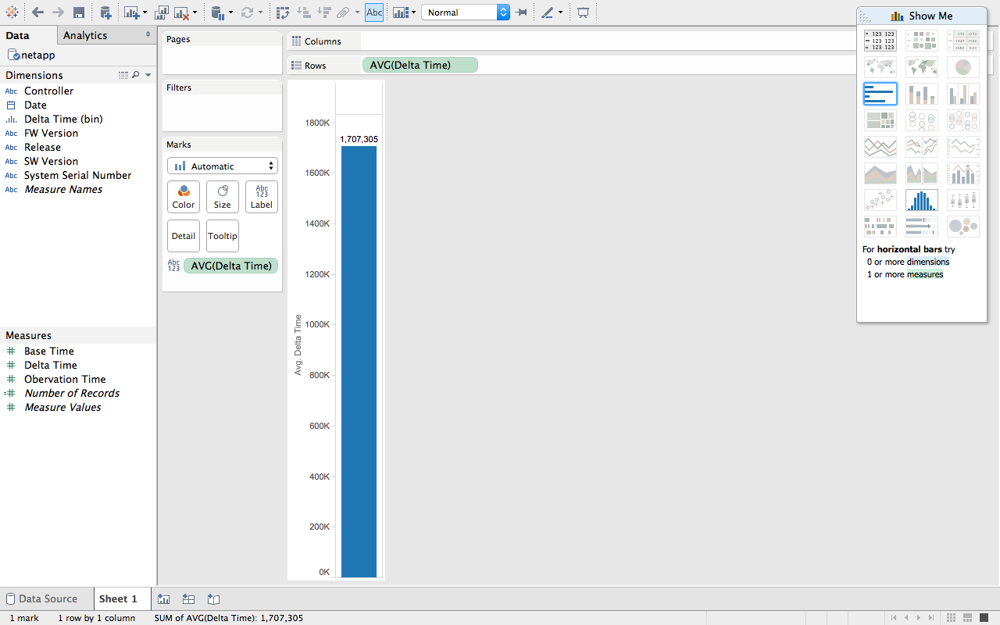
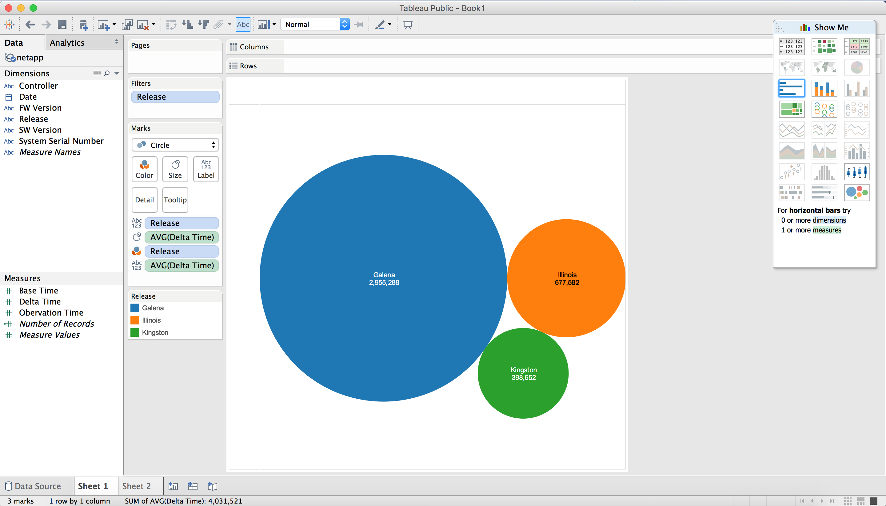
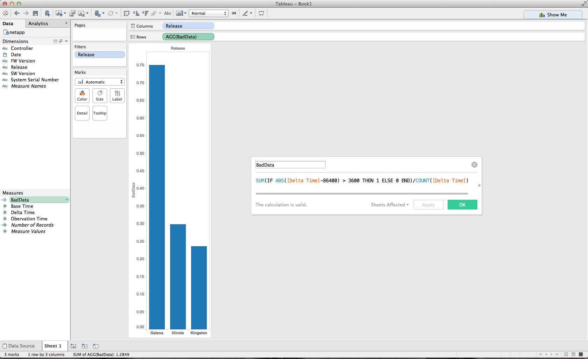
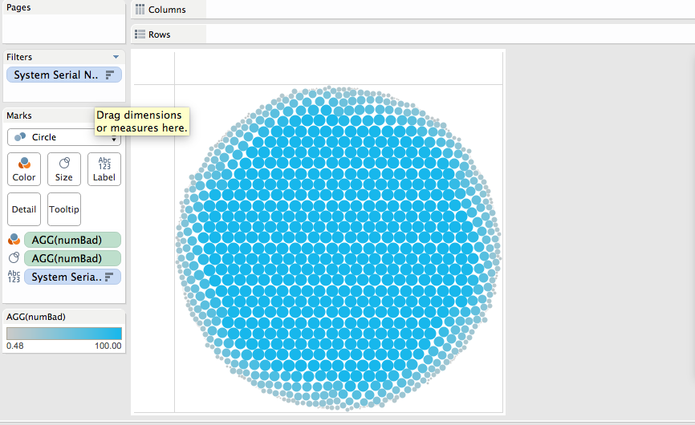
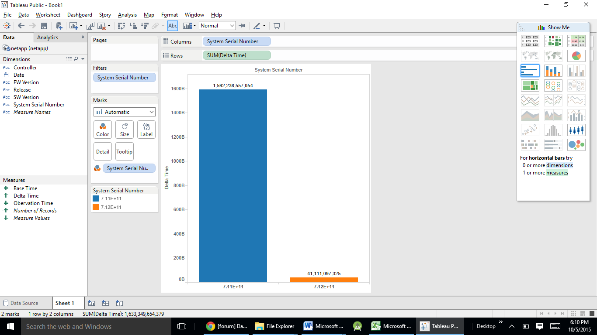

# NetApp

Brian McKean, a senior engineer at NetApp, gave a talk about his company in class.
He shared a data problem for our class to help solve.

# Tool
Tableau

# Authors

This report is prepared by
* [Satchel Spencer](https://github.com/satchelspencer)
* [John Murphy](https://github.com/johnmurph27)
* [Nicole Woytarowicz](https://github.com/nicolele)
* [Tristan Wagar](https://github.com/twagar95)
* [Sushant Mittal](https://github.com/sumi6109)

#What is the average delta? by Tristan

# Which release has the longest observation period on average? by Nicole
 

# Which release had the most inconsistent data? by Satchel

# What are the problem systems, those with the lowest percentage of usable data? by John

#Which system took most time to transmit the data? by Sushant

# Further Analysis

Our team determines the following questions are too complex for Tableau and require custom scripts to be written.

Of the entries with usable data, what is the average observation period for each release?